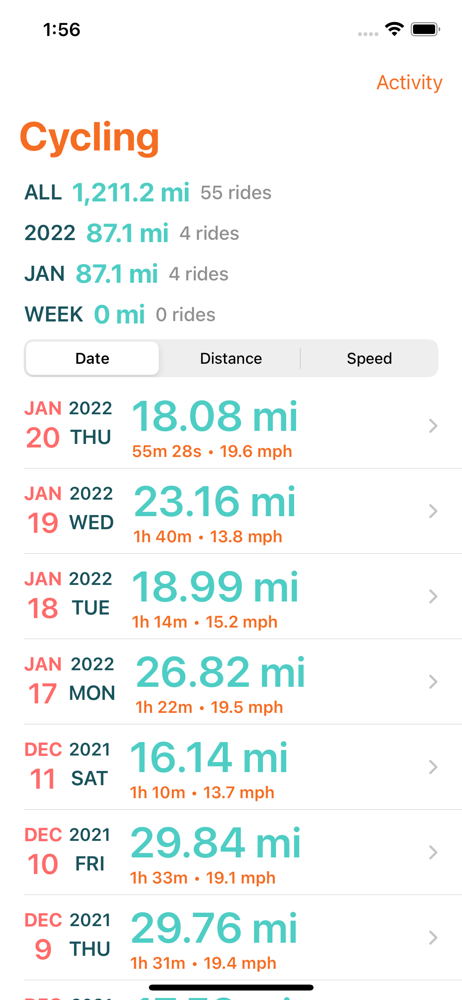

# BikeLog
### A playground for HealthKit workout data

BikeLog is an open source app exploring modern app development through the lens of displaying workout data from HealthKit.

## Development Concepts
### Framworks
- SwiftUI
- Combine
- Async/Await
- Measurement API
- iOS 15 `formatted` API

### Implementation Callouts
- Protocol based data provider `HealthProvider` to allow for mock providers that do not require HealthKit.
- Composable SwiftUI views, each with a `PreviewProvider` that uses mock data.
- AppStorage for preferences.
- HealthKit data updates sent back to an ObservableObject via a Publisher.
- HealthKit queries use the new Async HealthKit APIs available in iOS 15.4.
- Extending the Measurement API to create custom units to represent "pace" based speed.
- Unit Testing.

